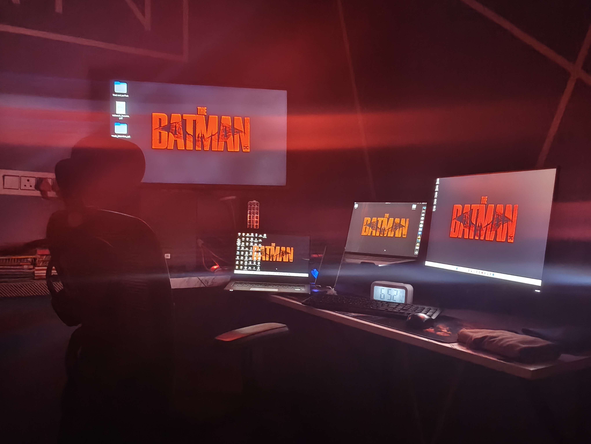

<h1 align="center">Hi 👋, I'm Sriram Nitheesh</h1>

<h3 align="center">
AI Engineer • Backend Developer • Cybersecurity Student
</h3>

Building intelligent systems, scalable backend architectures, and AI-powered applications.

---

<h2 align="center">📄 Resume</h2>

---

<h2 align="center">🚀 Core Technologies</h2>

---

<h2 align="center">🧠 Focus Areas</h2>

AI Systems • LLM Applications • Backend APIs • System Design • Cybersecurity

---

<h2 align="center">📚 Currently Learning</h2>

Distributed Systems • Advanced Backend Architecture • AI Engineering • System Design

---

<h2 align="center">🔥 Featured Projects</h2>

🚀 <b>AI Resume Analyzer</b>  
AI-powered system that analyzes resumes, extracts skills, evaluates ATS compatibility, and provides improvement suggestions.

  

⚡ <b>Disaster Prediction Management System</b>  
Machine learning-based prediction platform for earthquakes, floods, and cyclones built using Flask, Python, and real-time data analysis.

  

🛡 <b>Security Intelligence Platform</b>  
Backend architecture exploring defensive cybersecurity strategies and threat detection systems.

---

<h2>👨‍💻 About Me</h2>

<table border="0">
<tr>

<td width="60%" valign="top">

<ul>

<li>🎓 <b>BTech CSE (Cyber Security)</b> student at Sri Venkateswara College of Engineering</li>

<li>🧠 Passionate about <b>AI Engineering, Cybersecurity, and Scalable System Design</b></li>

<li>🛠 Building <b>backend systems and APIs using Python and FastAPI</b></li>

<li>📚 Practicing <b>Data Structures & Algorithms</b> to strengthen problem-solving and algorithmic thinking</li>

<li>🚀 Building projects in <b>AI systems, backend development, and system design</b></li>

<li>🧪 Exploring <b>real-world security problems and defensive security solutions</b></li>

<li>🎯 Achieved a <b>10/10 SGPA</b> and working to maintain consistent academic excellence</li>

<li>🥊 <b>State Champion Boxer (2022)</b></li>

</ul>

</td>

<td width="40%" align="center" valign="top">
 
 

</td>

</tr>
</table>

---

## 📊 GitHub Stats

---

## 📈 GitHub Activity Overview

---

## 🧠 Language Usage

---

## 🐍 Contribution Snake

---

<b>"Building intelligent, secure, and scalable systems."</b>

